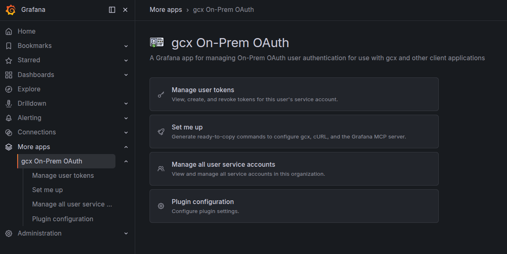
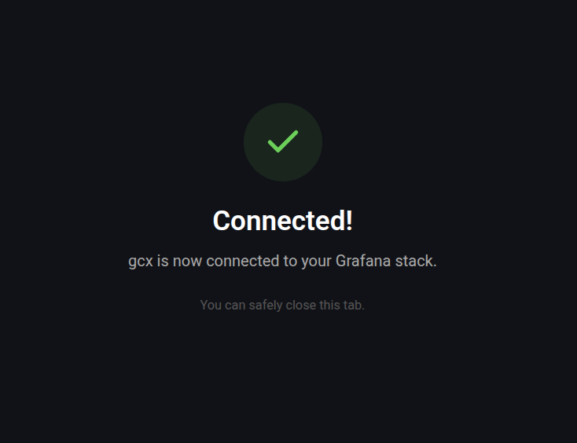
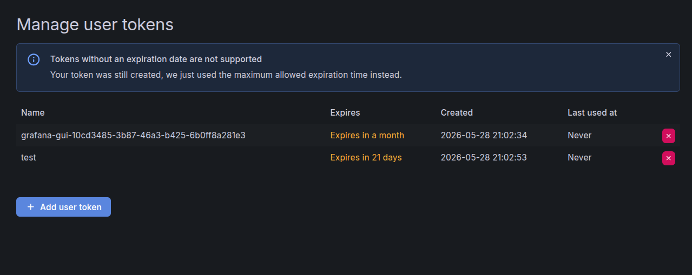

# gcx On-Prem OAuth


The gcx On-Prem OAuth app brings self-service, per-user API token management to on-premises Grafana installations, and exposes an OAuth-style authorization endpoint that command-line tools such as [gcx](https://github.com/joshuagrisham/gcx) can use to sign users in through their browser.

## Overview

Sharing long-lived organization service account tokens with end users is risky: tokens leak, can't be revoked per person, and don't carry the user's own role or audit identity. The gcx On-Prem OAuth app solves this by giving every Grafana user a dedicated service account they fully control, plus a loopback-based authorization flow that mints those tokens without ever asking the user to paste credentials into a terminal.

The app provides:

- A **Manage user tokens** page where each signed-in user can create, list, and revoke API tokens scoped to their own service account.
- A **Set me up** page that generates ready-to-copy configuration snippets for [gcx](https://github.com/joshuagrisham/gcx), `curl`, and the [Grafana MCP server](https://github.com/grafana/mcp-grafana), pre-filled with your server URL and current organization.
- An **OAuth-style `/authorize` endpoint** modeled on the OAuth 2.0 authorization-code flow with `state` for CSRF protection, designed for loopback redirect URIs used by native and CLI clients.
- A **backend service** providing the necessary endpoints for creating and managing the per-user service accounts and their tokens.
- A **background reconciliation loop** that mirrors user role changes onto the corresponding service accounts, prunes expired tokens after a configurable grace period, and removes service accounts that belong to deleted or disabled users.



### How users interact with it

End users can choose between managing their tokens from the **Manage user tokens** page in the UI, or running `gcx login` from a terminal. The CLI flow opens a browser tab on the plugin's **Authorize** page, confirms that the user is signed in to the target organization, and then uses the plugin's backend to provision the user's own service account and a fresh token. That token is delivered back to the CLI over the loopback redirect. The token belongs to the user's own service account, inherits the user's organization role, and can be revoked from the **Manage user tokens** page at any time.

## Requirements

- Grafana **12.3.0** or later.

## Getting started

### Install the plugin

Install from the Grafana plugin catalog:

```bash
grafana-cli plugins install joshuagrisham-gcxonpremoauth-app
```

Or, in the Grafana UI, go to **Administration > Plugins**, search for `gcx On-Prem OAuth`, and select **Install**.

Restart Grafana after installation.

### Configure the backend authentication mode

The plugin's backend needs a way to call the Grafana HTTP API on behalf of users. You can configure this in one of two ways.

#### Per-organization service account token

1. In each Grafana organization, create a service account with the **Admin** role and mint a token for it.
2. Go to **More apps > gcx On-Prem OAuth > Plugin configuration** and paste the token under **Organization Service Account Token**.

#### Basic Auth with a `GrafanaAdmin` user

For multi-organization installs where you don't want to provision a service account in every organization:

1. Enable Basic Auth (`auth.basic.enabled = true`, or `GF_AUTH_BASIC_ENABLED=true`).
2. Add `joshuagrisham-gcxonpremoauth-app` to Grafana's `forward_host_env_vars` setting.
3. Set the following environment variables on the Grafana server process:

   ```bash
   GF_PLUGIN_JOSHUAGRISHAM_GCXONPREMOAUTH_APP_BACKEND_USERNAME=<grafana-admin-user>
   GF_PLUGIN_JOSHUAGRISHAM_GCXONPREMOAUTH_APP_BACKEND_PASSWORD=<grafana-admin-password>
   ```

### Sign in with gcx

Once the plugin is installed and configured, users can sign in from their terminal:

```bash
gcx login \
  --context my-grafana \
  --server https://grafana.example.com \
  --org-id 1
```

This opens the Grafana authorization page in the user's browser. After the user approves, `gcx` stores the minted token under the named context.



CLI sign-in currently requires the [`joshuagrisham/gcx`](https://github.com/joshuagrisham/gcx) fork of `gcx`.

### Manage user tokens

Each user can manage their own tokens from the **Manage user tokens** page in the Grafana UI. Tokens can be created with a custom name and TTL, listed, and revoked individually.



## Configuration

### Plugin settings

The **More apps > gcx On-Prem OAuth > Plugin configuration** page requires the Grafana **Admin** role and exposes the following settings:

- **Organization Service Account Token** — the token used by the backend authentication mode described in [Per-organization service account token](#per-organization-service-account-token).
- Per-organization overrides for the tunable values listed in [Tunable environment variables](#tunable-environment-variables).

### Tunable environment variables

The plugin ID `joshuagrisham-gcxonpremoauth-app` must appear in Grafana's `forward_host_env_vars` setting so the plugin can read environment variables from the Grafana server process.

| Variable                     | Default   | Description                                                       |
| ---------------------------- | --------- | ----------------------------------------------------------------- |
| `GF_PLUGIN_JOSHUAGRISHAM_GCXONPREMOAUTH_APP_REQUEST_TIMEOUT`            | `30s`     | Per-request timeout for outbound calls to the Grafana HTTP API.   |
| `GF_PLUGIN_JOSHUAGRISHAM_GCXONPREMOAUTH_APP_MAX_TOKENS_PER_USER`        | `20`      | Maximum concurrently active tokens per user. `0` disables the cap.|
| `GF_PLUGIN_JOSHUAGRISHAM_GCXONPREMOAUTH_APP_TOKEN_MAX_SECONDS_TO_LIVE`  | `2592000` | Maximum TTL, in seconds, the plugin will mint (default 30 days).  |
| `GF_PLUGIN_JOSHUAGRISHAM_GCXONPREMOAUTH_APP_TOKEN_CLEANUP_GRACE_PERIOD` | `72h`     | Grace period after expiration before tokens are auto-deleted.     |
| `GF_PLUGIN_JOSHUAGRISHAM_GCXONPREMOAUTH_APP_CLEANUP_INTERVAL`           | `1h`      | How often the background reconciliation loop runs. `0` disables it.|

## Security model

- Each user gets a dedicated service account named `user:<login>` whose role mirrors that user's organization role. The reconciliation loop keeps the service account roles in sync with their corresponding users.
- All token operations are authorized server-side. The plugin verifies that the requested token ID belongs to the calling user's service account before forwarding the request to the Grafana API.
- Token names are length-validated and trimmed before being forwarded.
- The `/authorize` flow requires a `state` parameter for CSRF protection and a loopback `callback_port`, following standard patterns for native and CLI OAuth clients.

## Documentation

- **Source and issue tracker**: [github.com/joshuagrisham/grafana-gcx-on-prem-oauth-plugin](https://github.com/joshuagrisham/grafana-gcx-on-prem-oauth-plugin)
- **gcx CLI** (currently required for use with this plugin): [github.com/joshuagrisham/gcx](https://github.com/joshuagrisham/gcx)

## Contributing

Contributions, bug reports, and feature requests are welcome. Open an issue or pull request on [GitHub](https://github.com/joshuagrisham/grafana-gcx-on-prem-oauth-plugin).

## License

[Apache-2.0](https://github.com/joshuagrisham/grafana-gcx-on-prem-oauth-plugin/blob/main/LICENSE)
